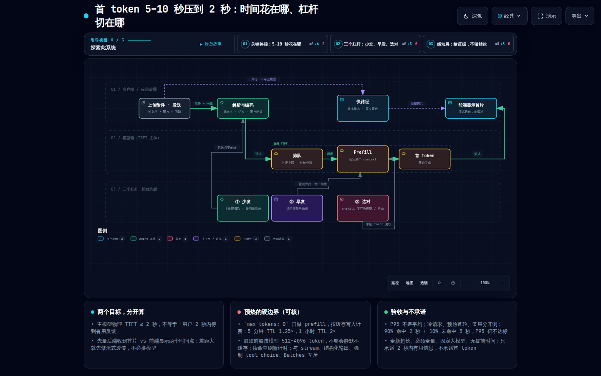
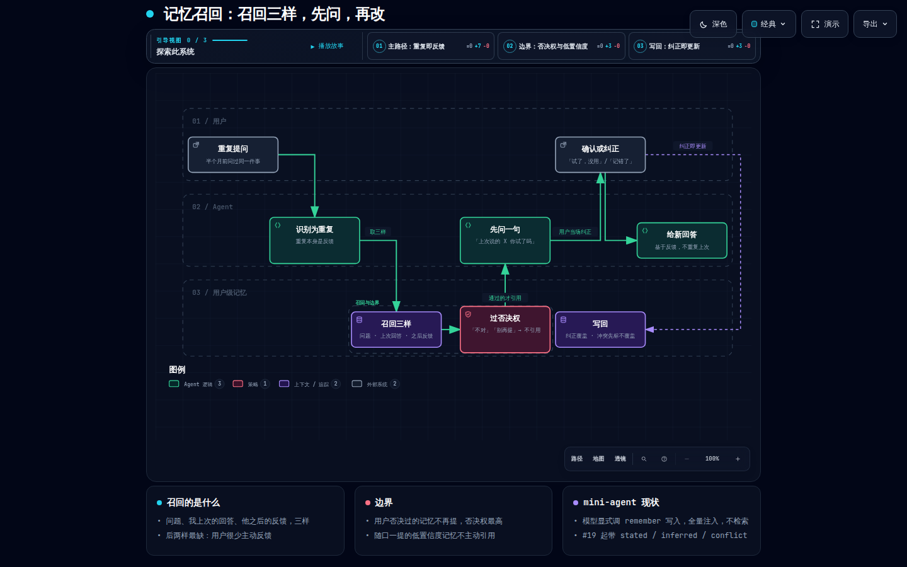
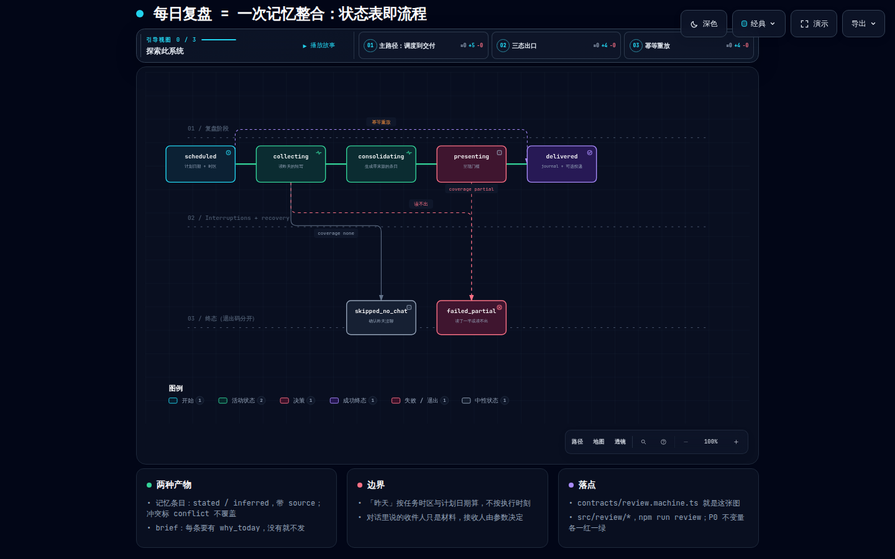
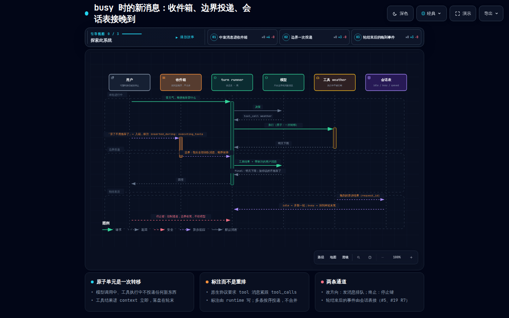
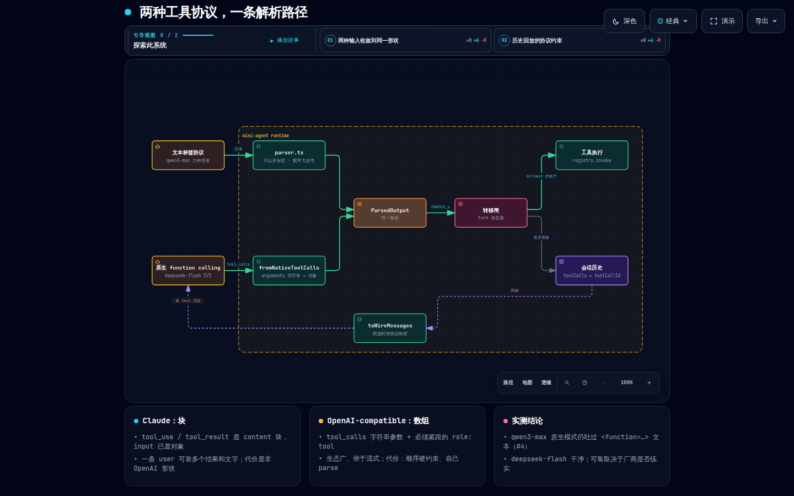

# mini-agent

从零实现的最小可用 Agent Runtime：loop / 工具注册 / 输出解析 / session / context 压缩 / trace。TypeScript，运行时依赖只有 OpenAI SDK（当 HTTP 客户端）。轮循环由状态表驱动，详见 `AGENTS.md`。

> **Python 版**在分支 [`agent-base-py`](https://github.com/zhangliyun2023/mini-agent/tree/agent-base-py)：同一套状态表、契约 JSON、答案卷、不变量与测试用例逐模块移植（pytest 全套、真实模型 smoke 与 judge.py 同样通过），`make install && make demo` 即可跑。

> **只想看最小 loop？** 三个文件够了：`contracts/turn.machine.ts`（循环的状态表，5 状态 × 6 事件）→ `src/runtime/agent.ts`（每步先 `interpret` 再执行副作用）→ `src/protocol/parser.ts`（模型输出怎么变成事件）。其余都是围绕这条 loop 的证明：契约、不变量、生成器、探索、证据。

## 5 分钟体验（不用自己打字）

```bash
npm ci && cp .env.example .env     # 填一个 OpenAI-compatible 的 key
npm run demo
```

固定几句话跑完 loop / 工具 / 两个窗口隔离 / 长期记忆 / 次日复盘，右侧实时回显每一次状态转移，数据落在临时目录。一次真实输出（deepseek-flash，全文在 `docs/evidence/demo/`）：

```
你> 帮我算 (137*29+1234)/7 保留两位
  ⎿ #1 t-llm-ok [noop] · llm#1 1086ms <think>需要精确计算</think><tool_call>{"name":"calculator",…}
  ⎿ #3 t-tools-done · tool calculator({"expression":"(137*29+1234)/7"}) ok 0ms → 743.8571428571429
  ⎿ #5 t-final · answer(final)
助手> (137×29+1234)/7 ≈ 743.857142857…，保留两位小数为 743.86。
你> 记两条待办：买牛奶、写周报            → 一步两个 todo 调用
你> 第一条做完了，把清单给我              → 带工具的追问，作用在同一清单
你> 记住我叫小张，常住上海                → remember 写用户级记忆（trace 里只见长度）
你> 那我住哪                              → 纯对话追问：你常住上海呀，小张

━━ 窗口 2（同一用户，另一个 session）━━
你> 我的待办清单里有什么                  → 清单是空的（session 隔离）
你> 我叫什么、住哪                        → 你叫小张，住在上海（记忆跨窗口）

━━ 次日早上的复盘 ━━
review A 2026-09-16 Asia/Shanghai → ok（attempts=1, coverage=full, entries_written=4）
昨天没收尾：待办里的周报还挂在清单上，昨天只划掉了买牛奶，记得找时间把周报写完。
delivered_to: w1
```

没有 key 也能看：`npm test`（假模型，条数见 `docs/TEST_REPORT.md` §0）、`npm run review -- --user A --fake ok`（复盘三态）、`python3 evals/judge.py evals/live-trace`（对仓库里已提交的真实模型转移记录跑不变量）。

## 运行

```bash
npm ci
cp .env.example .env        # 填任意 OpenAI-compatible 的 key；默认 DashScope qwen3-max，DeepSeek deepseek-flash 也实测通过
npm run chat -- --user A --session w1
```

- 同一 `--user` 开两个不同 `--session` 就是两个窗口，待办与历史互不可见；同一 `--session` 再进即接着聊。
- `--native-tools` 切到厂商原生 function calling；`--quiet` 关掉 trace 回显。
- 会话落在 `data/sessions/`，长期记忆在 `data/memory/`，trace 在 `trace/<session>.jsonl`（均不入库）。
- CLI 里 `/sessions` 列出本用户会话，`/exit` 退出。

## 验证

```bash
npm test                 # 全部单测，不需要 key；条数见 docs/TEST_REPORT.md §0
npm run check            # typecheck + 契约漂移检查 + 单测
npm run test:live        # 真实模型 5 个 smoke，需要 key
bash scripts/gate.sh v0.3   # 一键门禁，证据落 docs/evidence/v0.3/（无 key 时 live 写 skipped）
```

## 每日复盘

复盘（#19）不接真实 cron：触发 = 一条 CLI 子命令，外部 cron 调它；“至少一次”投递靠幂等键 `userId + date` 兜住（同一天重跑只把 `attempts` 加一，不重跑整合、不重写记忆、不重发）。

```bash
npm run review -- --user A                                  # 复盘“昨天”；--date 缺省 = 任务时区的今天，--tz 缺省 Asia/Shanghai
npm run review -- --user A --date 2026-09-15 --tz Asia/Shanghai --deliver w1   # 把 brief 追加进会话 w1
npm run review -- --fake ok                                 # 无 key 也能跑：脚本化模型 + 临时数据目录，另有 --fake no_chat / --fake partial_read
npm run review -- --user A --json                           # stdout 只输出 journal 原样 JSON
```

- 材料 = 昨天的逐轮转写 `data/transcripts/<user>/<session>.jsonl`（`npm run chat` 轮末追加），不读 `session.history`。`--data <dir>` 换存储根目录（chat 与 review 都认，缺省 `data/`）。
- 产物 = journal `data/reviews/<user>/<date>.json` + stdout 打印 brief。人读格式首行固定：`review <user> <date> <tz> → <status>（attempts=n, coverage=…, entries_written=…）`，然后 brief 全文（没有就打“（今天没有需要提醒的事）”），然后 `delivered_to:`。
- 三态：`ok`（昨天有可读转写，整合过了）/ `no_chat`（昨天一个会话都没有：不调模型、不写记忆、不交付）/ `partial_read`（有转写文件缺失或读不出：能读的照常整合，journal 里 `unreadable` 点名读不出的会话）。
- 退出码：`ok` / `no_chat` → 0；`partial_read` → 3（区分于失败，cron 里能看出“跑了但没读全”）；配置错误（参数 / key / 日期 / 时区）→ 1；运行时异常 → 2。
- `--deliver <sessionId>`：给了且 brief 非空，才往**那一个**会话历史追加一条 `{ role: "assistant", kind: "review_brief" }`；不给就谁也不追加。昨天对话里出现的“把总结发给 B”只是材料，接收人不会因此改变。
- `--fake ok|no_chat|partial_read`：不调模型，播种夹具转写到 `--data`（缺省一个临时目录）跑出对应状态，供测试与无 key 的评审用。
- 外部 cron 示例（每天 08:00 上海时间）：`0 8 * * * cd /path/to/mini-agent && npm run review -- --user A --deliver w1 >> data/review.log 2>&1`

## 系统设计

题目的四步循环就是 `contracts/turn.machine.ts` 那张表——runtime 每一步先 `interpret(state, event, facts)`，表允许才执行副作用：

```
用户输入 → deciding ──LLM_OK──▶ 解析 ──PARSED_FINAL────▶ done（返回给用户）
                        │              ├──PARSED_TOOL_CALLS─▶ executing_tools ──TOOLS_DONE──▶ deciding（继续 loop）
                        │              └──PARSED_ERROR───▶ blocked：错误回喂模型，本步不跑工具
                        └──LLM_FAILED──▶ error        步数用尽 ──▶ max_steps（交还已有结果）
```

| 题目要求 | 落点 |
|---|---|
| 从零、不依赖框架 | 运行时依赖只有 OpenAI SDK（当 HTTP 客户端）；loop / 解析 / 注册表 / session / 压缩全部自写 |
| 工具注册：名称 + 描述 + 参数 Schema，模型按 Schema 决策 | `src/tools/registry.ts`：`register(def)`，`specs()` 拼进 system prompt，`invoke()` 先校验 Schema（必填 / 类型 / 未知字段 / 枚举）再执行，结果经工具自己的 `compact` 精简、`redact` 脱敏后回填 |
| 至少三个工具 | calculator（白名单字符，不 eval 任意代码）、search（mock 语料）、todo（挂在 session 上的有状态工具）、remember（写用户级记忆） |
| 解析思考 / 工具调用 / 最终答案 | `src/protocol/parser.ts`：`<think>` `<tool_call>{json}` `<final>` 三段协议；只认开标签、JSON 靠配平大括号截取；接住真实模型实测的六种偏差（`<invoke>` 别名、裸 JSON、`<tool_code>` 外包、`<function=…>` 变体、闭合写成开标签、`<final>` 重复/无闭合）；解析错误回喂模型自纠，永不抛异常 |
| 原生 function calling | `--native-tools`：厂商 `tool_calls` 转成同一套标签走同一条解析路径 |
| session：用户 A 两个窗口独立、随时接着聊 | `(userId, sessionId)` 定位一个会话；历史、有状态工具的数据袋、轮次计数都在会话上；文件存储每会话一个 JSON，重进即续 |
| 最大轮次 | 两层：一次输入内最多 8 次模型决策（安全阀，到顶交还最近三条工具结果）；会话历史超 40 条或 12k 字符触发压缩；system prompt 里的记忆块另有 1200 字符上限（见“Context 与 memory”） |
| 异常处理 | 模型调用指数退避重试 2 次后以可读错误结束；工具抛错 / 参数错 → `[error]` 结果回喂；解析失败 → blocked 回喂；表里没列的 (状态, 事件) → unknown，不执行副作用、记 trace、error 终态 |
| trace / 执行日志 | `trace/<session>.jsonl`，一次状态转移一行：`trace_id`（一轮）、`transition`（行 id）、`status`、每个模型 / 工具调用作为 effect 带 `request_id`、耗时、token、预览；CLI 实时回显 |

## Context 与 memory：放什么、何时召回、放在哪

**进 context 的**（每次模型调用的消息列表，`src/session/context.ts::assembleMessages`）：

1. system prompt：角色 + 协议 + 规则 + 工具清单（含 Schema 原文）+ **用户级记忆块**（有上限，见下）
2. 压缩摘要（如果有）：一条 system 消息“此前对话摘要”
3. 会话历史：用户输入、模型的工具调用文本、**精简后的**工具结果、最终答案
4. 本轮消息：本轮全部往返，含当轮的 `<think>`

**不进的**：历史轮的思考过程——轮次结束时剥掉（`stripThink`），它只对当轮有用；工具结果的原文超过 1500 字符的部分。

**压缩**（题目要的“基础压缩”）：历史超阈值时，保留最近 12 条原文，切点回退到 user 消息（不把一轮 tool_call / tool 从中间切断），更老的部分让模型压成 ≤200 字要点（累积在会话上）；模型失败退回规则压缩（保留用户原话 + 答案首句）。追问仍能接上，因为最近几轮原文都在。

**预算是两个独立上限，不是一个总预算**（`src/session/context.ts::ContextOptions`）：

| 上限 | 默认 | 超了怎么办 |
|---|---|---|
| 历史：`maxHistoryMessages` / `maxHistoryChars` | 40 条 / 12k 字符 | `needsCompaction` 只量 `session.history`，触发上面的压缩 |
| 记忆块：`memoryMaxChars` | 1200 字符（= 历史阈值的 10%） | `renderMemory` 按写入顺序保留最新的条目，截掉最老的；trace 记一条 `memory_truncated` warning |

为什么不把 system prompt 长度并进历史阈值：system prompt 的其余部分（协议 + 工具 Schema）是常量，唯一会长的记忆块已经被自己的上限封顶，所以 system prompt 的大小是有界、可预测的；如果把它算进历史预算，记忆一多就会让历史被提前压缩，两个原因互相掩盖，排查时说不清是哪个撑爆了。两个独立上限各管各的，trace 上 `compact` 与 `memory_truncated` 也分开可见。这条行为由 `test/unit/session-context.test.ts`“历史阈值与记忆上限是两个独立上限”锁定。

**追问**：纯对话追问靠历史里的用户输入 + 最终答案；带工具的追问（“把第一条标完成”）靠 todo 的状态挂在会话上——工具结果本身已精简，但状态在 `session.state` 里完整保留。

**用户级 memory**（跨会话）：

| | 做法 |
|---|---|
| 写入时机 | 模型显式调 `remember(key, value)`——用户说“记住…”或透露稳定信息（称呼、城市、职业、长期偏好）；没调用就不算记住，prompt 禁止口头“已记下” |
| 召回时机 | **每轮组 context 时**，不做检索：`memory.load(userId)` 全量取出，再按上限截 |
| 放置位置 | system prompt **尾部**的 `<memory>` 块，逐条 `- key: value`，标明是过去的观察不是规则 |
| 上限与截断 | 整块 ≤ `memoryMaxChars`（默认 1200 字符，即历史阈值 12k 的 10%）；超限按**写入顺序**保留最新的条目、截掉最老的（同 key 覆写算重新写入，位置不变）；不做时间衰减、不按“最近用到”排序。截断事实作为 `memory_truncated {total, kept, limit}` warning 挂在本轮第一条转移的 effects 上（与 `compact` 同一挂法），模型看到的块里没有被截掉的条目 |
| 为什么不检索 | 条目少时全量注入比检索稳，且“召回时机 / 位置”一句话说清；现在的兜底是上限 + 截最老，够用到条目多得“最新的 1200 字符”不再是想要的那批为止——那时才值得上检索式召回，列在 `docs/NEXT_STEPS.md` |
| 隔离 | 按 userId 一个文件；别的用户看不到；trace 里 remember 的 value 只记长度 |

## 架构题图解

`docs/DESIGN-QUESTIONS.md` 五题各配一张图，放在 `docs/diagrams/`。每题三个文件：Typed JSON 源（`*.<type>.json`，改图改这个）、交付的独立 HTML（打开即看，可切深浅色、按“引导视图”分步看、导出 PNG/SVG）、1440×900 深色截图 PNG（README 里直接看）。

| 题 | 类型 | 一句话 | 文件 |
|---|---|---|---|
| 模块一 · 首 token 压到 2 秒 | workflow | 三条泳道（客户端/应用后端 · 模型侧 · 三个杠杆）；少发、早发、选对模型三个杠杆分别落在哪一段 | `q1-ttft.workflow.json` · `q1-ttft.html` |
| 模块二 · 重复提问时的记忆召回 | workflow | 用户 / Agent / 用户级记忆三道：召回三样 → 过否决权 → 先问一句 → 纠正即写回 | `q2-memory-recall.workflow.json` · `q2-memory-recall.html` |
| 模块三 · 每天 9 点复盘 | lifecycle | 就是 `contracts/review.machine.ts`：scheduled → collecting → consolidating → presenting → delivered，三个出口（skipped_no_chat / failed_partial / 幂等重放）分开画 | `q3-daily-review.lifecycle.json` · `q3-daily-review.html` |
| 模块四 · busy 时收到新消息 / 异步结果 | sequence | 中途消息进收件箱并带插入时机标注，TOOLS_DONE 之后、下次模型调用之前一次投递；轮结束后的晚到事件由会话表接 | `q4-busy-inbox.sequence.json` · `q4-busy-inbox.html` |
| 模块五 · 两种工具协议 | architecture | 文本标签经 parser、原生 tool_calls 经 adapter，收敛成同一形状的 ParsedOutput 再过转移闸；历史回放时按协议映射、对不上位的降级为 user | `q5-tool-protocols.architecture.json` · `q5-tool-protocols.html` |

模块一 · 首 token 压到 2 秒（workflow）



模块二 · 重复提问时的记忆召回（workflow）



模块三 · 每天 9 点复盘（lifecycle）



模块四 · busy 时收到新消息 / 异步结果（sequence）



模块五 · 两种工具协议（architecture）



**怎么画的**：用 archify（github.com/tt-a1i/archify，CLI 2.17.0-dev.1）按它 SKILL.md 的作法：先写 Typed JSON，`validate <type> <json> --quality showcase --json` 过零诊断，再 `deliver` 出 HTML（原子写入，失败保留上一版），最后 `visual-check` 在 1440×900 / 1600×1000 / 1920×1080 / 2048×1320 深浅两色下截图并核对不溢出、不裁切、字号可读。五张图三道都过；每张图的 JSON 是唯一源，HTML 与 PNG 都由它生成，改图不要直接改 HTML。archify 本身不是本仓库的依赖或 skill，只放图和 JSON。

模块三那张图有一处取舍：`conflict` 在 #19 里是记忆条目的状态，不是复盘状态机的状态，所以没画成节点，只在卡片里写“同 key 不同值标 conflict，不覆盖”。

## 指路

- 入口（七章节）：`AGENTS.md`
- 架构与机器清单：`docs/ARCHITECTURE.md`
- 规格与用户故事：`docs/SPEC.md`
- 状态机线的决定：`docs/product/SPEC-state-machines.md`
- 测试报告（三层分开写）：`docs/TEST_REPORT.md`
- 下一步：`docs/NEXT_STEPS.md`
- AI 协作记录：`AI-LOG.md`
- 架构设计题答案（五模块各一题）：`docs/DESIGN-QUESTIONS.md`；配图（JSON 源 + HTML + PNG）：`docs/diagrams/`
